 

## `// EQUIPO DE BUCEO`

 
<code>JavaScript · Node.js · HTML · CSS · Python · Git · Docker · Jenkins · Linux</code>

  

## `// HALLAZGOS`

 

## `// LECTURAS DEL SONAR`

  

<code>fin de la transmisión · Hecho en Chile · @vnoram</code>

